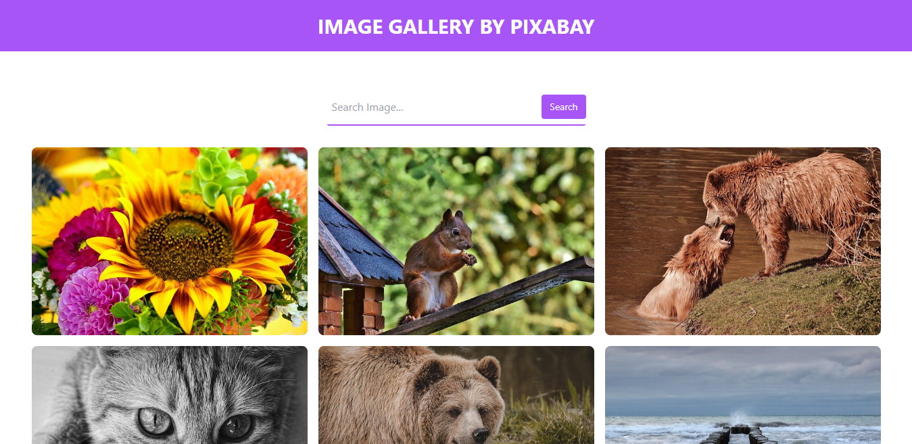

# React Image Gallery

Membuat Website berisi foto dengan React yang diambil menggunakan API [Pixabay API](https://pixabay.com/api/docs/).



## Fitur yang tersedia

- Menampilkan foto
- Mencari foto
- Dark mode

## Cara Install

Buka terminal/CMD. Pastikan berada pada direktori tempat menyimpan project.

```bash
git clone https://github.com/Mahib22/react-notes-app.git

cd react-notes-app

npm install

npm start
```

Buka [http://localhost:3000](http://localhost:3000) untuk melihat pada browser.
